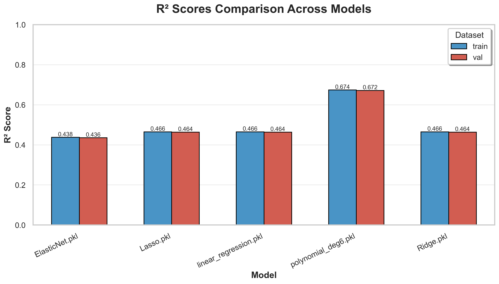

# Trip-Duration-Prediction

<a target="_blank" href="https://cookiecutter-data-science.drivendata.org/">
    
</a>

## Overview
This project predicts the **total trip duration** for New York City taxi rides based on pickup and dropoff coordinates, passenger count, timestamps, and other features.  

The dataset is provided by the **NYC Taxi and Limousine Commission (TLC)** and was featured in a Kaggle competition:  
🔗 [**Kaggle - New York City Taxi Trip Duration**](https://www.kaggle.com/competitions/nyc-taxi-trip-duration)

## Project Organization

```
├── LICENSE             
├── Makefile            
├── README.md          
├── data
│   ├── external        
│   ├── interim        
│   ├── processed       
│   └── raw             
│
├── models             
│
├── notebooks           
│   ├──exploration .ipynb                       
│                         
│
├── pyproject.toml    
│                         
│
├── reports            
│   └── figures         
│
├── requirements.txt    
│                         
│
└── src   
    │
    ├── utils.py
    │
    ├── config.py                
    │
    ├── features.py
    │
    ├── plots.py
    │
    ├── predict.py
    │
    └── train.py
```

--------

##  Dataset Schema

| **Column**            | **Meaning**                                                                 |
|------------------------|------------------------------------------------------------------------------|
| `id`                   | Unique identifier for each trip                                             |
| `vendor_id`            | Provider code indicating the taxi company                                   |
| `pickup_datetime`      | Timestamp when the meter was engaged (trip start)                           |
| `dropoff_datetime`     | Timestamp when the meter was disengaged (trip end) — only in training data  |
| `passenger_count`      | Number of passengers (entered by the driver)                                |
| `pickup_longitude`     | Longitude coordinate of the pickup location                                 |
| `pickup_latitude`      | Latitude coordinate of the pickup location                                  |
| `dropoff_longitude`    | Longitude coordinate of the dropoff location                                |
| `dropoff_latitude`     | Latitude coordinate of the dropoff location                                 |
| `store_and_fwd_flag`   | `Y` if the trip data was stored temporarily and sent later, otherwise `N`   |
| `trip_duration`        | **Target variable** – total trip duration in seconds                        |

---
##  Features and Pipeline

1. **Exploratory Data Analysis (EDA)**  
   - Distribution of trip durations.  
   - Relationship between trip distance, time, and duration.  
   - Outlier and anomaly detection.  

2. **Feature Engineering**  
   - Extracted time-based features (hour, weekday, month, etc.).  
   - Calculated distance between pickup and dropoff points.  
   - Derived  log-transformed trip duration.  

3. **Data Preprocessing**  
   - Feature splitting into categorical and numerical. 
   - One-hot encoding for categorical features. 
   - Standard scaling for numerical features.  
   - Remove outliers.

## ⚙️ Modeling

This project focuses on **learning, experimentation, and understanding regression models** rather than purely optimizing for the best score.  
The selected models were intentionally chosen to explore how different types of linear and regularized regressions behave on the dataset.  
### Tested Models

| **Model** |  
|------------| 
| **Linear Regression** |  
| **Ridge Regression** | 
| **Lasso Regression** |  
| **ElasticNet Regression** |  
| **Polynomial Feature Expansion (degree = 6) + Linear Regression** |  

---

###  Results

The chart below compares **R² Scores** for all models across training and validation datasets.

<p align="center">
  
</p>

- **Polynomial Regression (degree 6)** achieved the highest R² score (~0.67), showing its ability to model complex relationships.  
- Other linear and regularized models (Ridge, Lasso, ElasticNet) achieved R² ≈ 0.46, indicating similar performance.  

---

###  Key Insights
- Polynomial feature expansion significantly improved model performance compared to standard linear regressions.  
- Regularization (L1/L2) had limited impact due to the moderate number of features.  
- The main takeaway: **feature engineering and transformations** can often have a greater effect than simply changing models.  

---

📘 *Note:*  
> This modeling stage was primarily designed for **educational purposes** — to understand regression behavior, data transformations, and feature preprocessing pipelines.  
> Future experiments could include advanced models such as **Random Forest, XGBoost, or Gradient Boosting** to further improve predictive performance.

---
